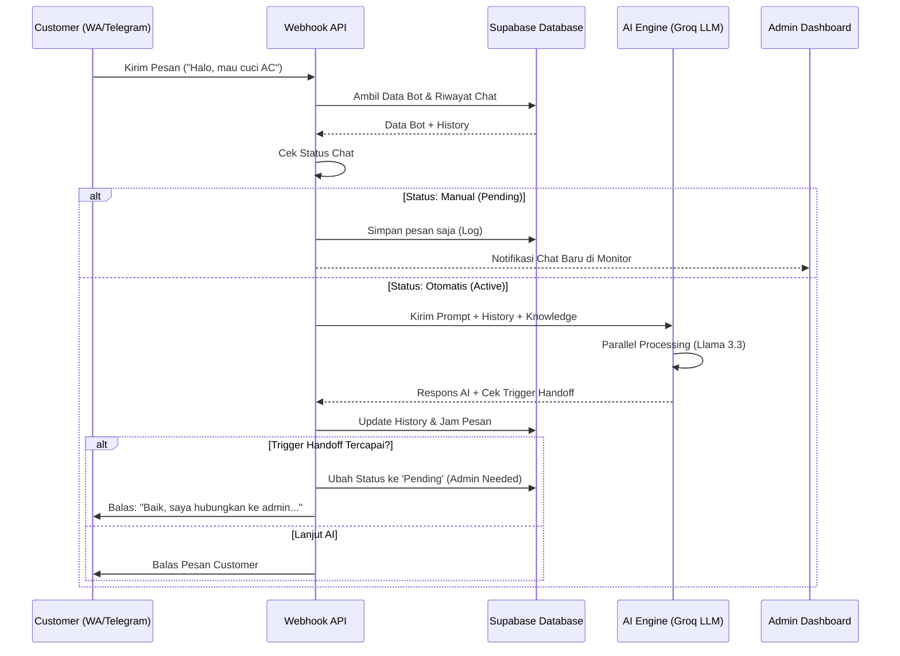

# Dokumentasi Alur Sistem (System Flow) AI Agent

Dokumen ini menjelaskan perjalanan data dari saat customer mengirim pesan hingga AI memberikan balasan di platform **Lincah AI**.

---

## 🏗️ Arsitektur Alur Pesanan

---

## 📋 Penjelasan Detail Step-by-Step

### 1. Webhook Entry (Pintu Masuk)
Pesan dari WhatsApp atau Telegram masuk melalui endpoint API webhook (`/api/webhook/telegram` atau `whatsapp`). 
*   **Identifikasi:** Sistem mencari ID Bot dan ID Customer untuk menentukan siapa yang sedang bicara.
*   **History Management:** Jika customer baru, sistem akan otomatis membuat profil `Lead` baru di CRM.

### 2. Handoff Guard (Filter Manual/Otomatis)
Sistem mengecek kolom `status` di tabel `conversations`:
*   **Active:** Chat ditangani 100% oleh AI.
*   **Pending:** Admin sedang mengambil alih. AI akan "diam" dan hanya mencatat percakapan agar admin bisa membaca history-nya nanti.

### 3. AI Processing (Otak Agen)
Sistem menggunakan **dua model AI secara paralel** (via Groq Cloud) untuk kecepatan maksimal:
*   **Model Respons (Llama 3.3 70B):** Bertugas membuat jawaban yang natural berdasarkan *System Prompt* dan *Knowledge Base*.
*   **Model Checker (Llama 3.1 8B):** Bertugas mendeteksi secara instan apakah customer sudah memenuhi syarat untuk transfer ke admin (misal: "Saya mau bayar", "Butuh teknisi segera").

### 4. Knowledge Retrieval (RAG)
Sebelum ke AI, sistem mengambil konteks dari **Knowledge Source**. Jika customer bertanya harga, sistem akan menyisipkan data harga yang sudah kamu input ke dalam prompt AI, sehingga AI tidak akan berhalusinasi (ngarang harga).

### 5. Outbound Response (Balasan Balik)
Setelah AI memberikan jawaban:
*   **Simpan Ke DB:** Pesan disimpan agar sinkron dengan dashboard `/monitor`.
*   **Kirim Pesan:** Pesan diteruskan kembali ke aplikasi WA/Telegram customer.
*   **Notifikasi Owner:** Jika terjadi *handoff* (pindah ke admin), sistem bisa mengirim notifikasi khusus ke WhatsApp owner agar segera membalas chat tersebut.

---

## ⚡ Keunggulan Workflow Lincah AI
1.  **Zero Latency Sensing:** Pengecekan handoff dilakukan bersamaan dengan pembuatan jawaban, jadi tidak ada delay tambahan.
2.  **Hybrid Flow:** Admin bisa intervensi kapan saja hanya dengan menekan tombol "Switch to Manual" di dashboard.
3.  **Context-Aware:** AI selalu ingat 10-15 percakapan terakhir agar jawaban tetap nyambung (tidak seperti bot tombol/rule-based biasa).
